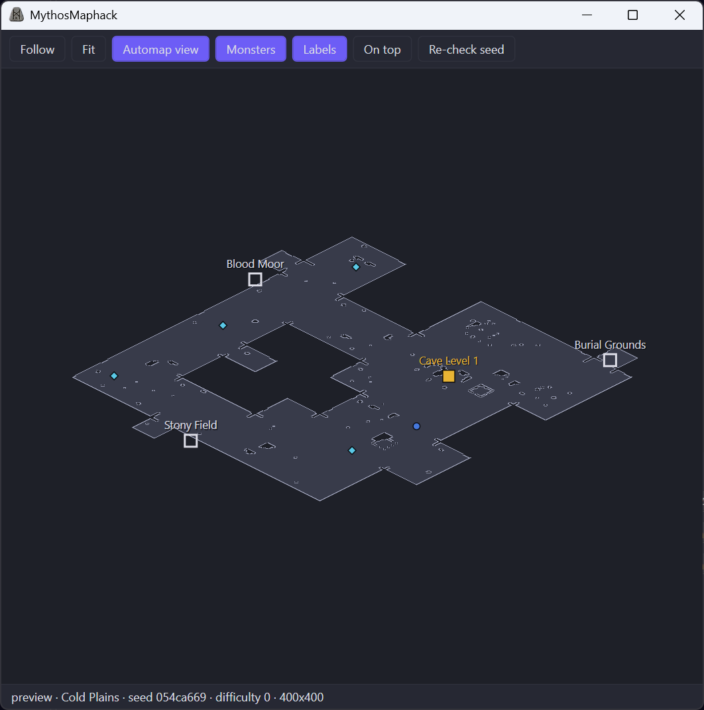

  

<h1 align="center">MythosMaphack</h1>

  
  
  
  

---

> [!IMPORTANT]
> **0.1.0-preview is out for testers.** [Download it from the Releases page](../../releases).
> This preview has not been tested against a live game yet; see the
> [release notes](CHANGELOG.md) for its known limits, and tell us how it went on
> [Discord](https://discord.com/invite/d2rmythos).

**MythosMaphack** shows the full map of the level you are in, in its own window next to Diablo II:
Resurrected. Walls, every exit and where it leads, waypoints, shrines, bosses and quest objects are all
there the moment you enter a level, before you have explored any of it.

  

## ✨ Features

| | |
|---|---|
| 🗺 **Whole level at once** | The full layout of the current level, generated the same way the game generates it |
| 🚪 **Exits with names** | Every way out of the level, labelled with where it leads; stairs and cave entrances stand out |
| ⛩ **Points of interest** | Waypoints, shrines, wells, super chests, quest objects (Cairn Stones, the true Tal Rasha tomb, Diablo's seals …) and bosses |
| 👥 **Live units** | You, other players and monsters, updated ten times a second |
| 🧭 **Automap view** | A 45° view that matches the in-game automap, or a flat top-down view; follow yourself, fit the whole level, pan and zoom |
| 🪟 **Its own window** | Nothing is drawn over the game. Put it on a second monitor or keep it on top |
| 🖥 **Several games** | Running more than one client (for example with MythosLoader)? Pick which one to map |

## 🧠 How it works

1. MythosMaphack finds the running game and checks its version. It only works with the game version it was
   built for, and says so clearly when the game has been patched.
2. It **reads** a few values from the game: which level you are in, where you are, and the objects and
   monsters around you. It reads only; it never changes anything in the game.
3. It generates the level on your PC with [libd2](https://github.com/jaenster/libd2), an open-source
   re-creation of Diablo II's level generator, and checks the result against the objects the game has
   actually loaded. The status bar shows a ✓ once the map is confirmed.

Everything happens on your computer. MythosMaphack does not connect to any server.

## 🔒 Security and privacy

- **Read only.** MythosMaphack asks Windows for read access to the game process and nothing more. It does
  not write to the game, inject anything into it, attach a debugger, or send keystrokes or clicks.
- **No account data.** It never reads or stores your Battle.net login, password or character names.
- **No network.** No server, no telemetry.
- **No admin rights.** Run it as a normal user.

## 💻 Requirements

- Windows 10 (1809 or newer) or Windows 11, 64-bit.
- Diablo II: Resurrected, the version named on the release page.

## 🚀 Getting started

1. Download **MythosMaphack-0.1.0-preview-win-x64.zip** from the [Releases page](../../releases) and unzip it
   anywhere.
2. Start `MythosMaphack.exe`. It says "waiting for D2R.exe" until the game runs.
3. Start the game and join a game. The map appears when you enter a level; the status bar shows the level,
   the difficulty and a ✓ once the map is confirmed.
4. **Follow** keeps you in the middle, **Fit** shows the whole level, the mouse wheel zooms, dragging pans.

## ❓ FAQ

<b>Will I get banned?</b>

Using third-party programs that read the game is against Blizzard's terms of use, and Blizzard can act on
that. MythosMaphack only reads and never changes the game, but that does not make it safe or
undetectable. You decide whether to use it, at your own risk.

<b>The window says the game version is not supported.</b>

The game was patched after this version of MythosMaphack. Wait for an update; it is announced on
[Discord](https://discord.com/invite/d2rmythos).

<b>Does it draw on top of the game?</b>

No. It is a normal window. Use "On top" to keep it above the game in windowed mode, or put it on another
screen.

## 💬 Community and support

Help, bug reports and ideas: **[D2R Mythos Discord](https://discord.com/invite/d2rmythos)**.

## ⚖ Disclaimer

MythosMaphack is not affiliated with or endorsed by Blizzard Entertainment. Diablo and Battle.net are
trademarks of Blizzard Entertainment, Inc. Use of third-party tools may violate the game's terms of use;
you use MythosMaphack at your own risk. See [`LICENSE.md`](LICENSE.md).
